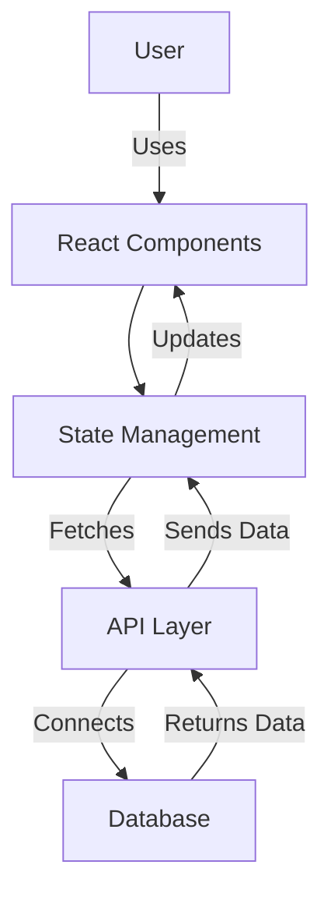

```mermaid
  graph TD;
      A[User] -->|Uses| B[React Components];
      B --> C[State Management];
      C -->|Fetches| D[API Layer];
      D -->|Connects| E[Database];
      E -->|Returns Data| D;
      D -->|Sends Data| C;
      C -->|Updates| B;
```